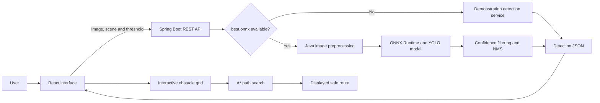

# OrbitGuard

An interactive satellite and space-debris detection and collision-avoidance planning demonstrator.

> **Academic prototype:** OrbitGuard is intended for learning and assessment. The bundled detections are labelled simulations. It must not be used to make operational spacecraft decisions.

## Project overview

The number of satellites and debris objects in Earth orbit makes manual inspection of surveillance images slow and difficult. OrbitGuard demonstrates how an AI-assisted system can support this task by combining:

- YOLO-based satellite and debris detection from an image.
- Confidence scores and bounding boxes for understandable results.
- A confidence threshold for handling uncertain detections.
- A* search for demonstrating collision-free route planning around confirmed obstacles.
- A responsive interface for explaining the complete workflow during an assessment.

The Java API runs in one of two modes:

| Mode | Behaviour |
|---|---|
| Demonstration | Returns clearly labelled sample detections so the complete application works without a trained model. |
| Live inference | Loads `models/best.onnx` and performs YOLO inference with ONNX Runtime for Java. |

## Application screenshot


### Bundled sample scenes

| LEO scene | Station vicinity | Debris field |
|---|---|---|
|  |  |  |

The sample images support interface testing and classroom demonstrations. They are not labelled scientific observations and must not be used to calculate model accuracy.

## Main features

- Choose a bundled space scene or upload a JPG/PNG image.
- Detect satellites and debris with a YOLO ONNX model.
- Inspect the predicted class, confidence and bounding-box position.
- Filter uncertain detections with the confidence slider.
- Select the same object from either the image or the result inspector.
- Add and remove obstacles on an interactive planning grid.
- Recalculate a shortest collision-free route using A* search.
- Continue in safe demonstration mode when no ONNX model is installed.

## Technology stack

| Layer | Technology | Purpose |
|---|---|---|
| Frontend | React 19, Vite, CSS | Interactive detection viewer and planning interface |
| Backend | Java 21, Spring Boot 3 | REST API, validation and application services |
| AI runtime | Microsoft ONNX Runtime for Java | Executes an exported YOLOv5 ONNX model |
| Image processing | Java AWT and ImageIO | Decodes, resizes and normalizes uploaded images |
| Planning | Java 21 A* service | Calculates the shortest grid route through `POST /api/plan` |
| Testing | JUnit 5 and Spring MockMvc | Tests detection rules and API responses |
| Build tools | Maven and npm | Builds the Java API and React frontend |

Python is not required to run OrbitGuard. It is used only by the optional upstream YOLOv5 training and ONNX export workflow.

## System architecture



### Main components

```text
YoLo/
├── backend-java/
│   ├── pom.xml
│   └── src/
│       ├── main/java/com/orbitguard/
│       │   ├── config/       # CORS configuration
│       │   ├── controller/   # Health and analysis endpoints
│       │   ├── model/        # API response records
│       │   └── service/      # Java ONNX inference and A* planning
│       └── test/              # Java tests
├── docs/                      # Application screenshot
├── models/                    # Optional best.onnx and classes.txt
├── public/samples/            # Bundled demonstration scenes
├── src/
│   ├── components/            # React interface components
│   ├── data/samples.js        # Demonstration scene data
│   ├── config.js              # Java API address
│   ├── App.jsx
│   └── styles.css
├── package.json
└── README.md
```

## How the system works

### 1. Image input

The user selects a bundled scene or uploads a JPG/PNG image of up to 10 MB. The frontend sends the image, selected scene and confidence threshold to `POST /api/analyze` as multipart form data.

### 2. Model selection

The Java backend checks for `models/best.onnx`. If the file is absent, it returns the documented demonstration detections. If the file exists, the backend activates live inference.

### 3. Java preprocessing and inference

For live inference, Java decodes the image, resizes it to 640 x 640 pixels, converts the pixels into normalized CHW float tensors and sends the tensor to ONNX Runtime.

### 4. Result processing

The backend reads common YOLOv5 output shapes, calculates class confidence, removes weak predictions and applies non-maximum suppression to overlapping boxes. It returns normalized bounding boxes so the React interface can draw them at any display size.

### 5. Uncertainty handling

Each prediction includes a confidence value between 0 and 1. The user-controlled threshold removes results below the selected confidence. Borderline objects require additional sensor evidence and human review before they can become planning obstacles.

### 6. Route planning

The planning grid represents the satellite start position, target position and confirmed debris cells. The frontend sends this state to the Java planning service. Java A* calculates `f(n) = g(n) + h(n)`, where `g(n)` is the travelled cost and `h(n)` is the Manhattan-distance estimate. Editing an obstacle triggers another API request and immediate route recalculation.

## API endpoints

| Method | Endpoint | Description |
|---|---|---|
| `GET` | `/api/health` | Reports API status, runtime and inference mode |
| `POST` | `/api/analyze` | Accepts an image/scene and returns filtered detections |
| `POST` | `/api/plan` | Runs Java A* over a grid and returns the shortest available path |

### Sample health output

```json
{
  "status": "ok",
  "mode": "demo",
  "model": null,
  "runtime": "Java 21 + Spring Boot"
}
```

### Sample analysis output

Request: `scene=leo`, `confidence=0.90`

```json
{
  "mode": "demo",
  "detections": [
    {
      "id": "leo-sat",
      "label": "Satellite",
      "confidence": 0.93,
      "color": "cyan",
      "box": [69.0, 26.0, 25.0, 43.0]
    }
  ],
  "message": "Bundled demonstration detections. Add models/best.onnx for Java ONNX inference."
}
```

`box` contains `[x, y, width, height]` as percentages of the displayed image.

## Installation and startup

### Prerequisites

- [Node.js 20 or newer](https://nodejs.org/)
- [Java Development Kit 21](https://learn.microsoft.com/en-us/java/openjdk/download-major-urls)
- [Apache Maven 3.9 or newer](https://maven.apache.org/download.cgi)
- Git

### Start the complete application

```bash
git clone https://github.com/Shushant-Kharate/YoLo.git
cd YoLo
java -version
mvn -version
npm install
npm start
```

Open [http://localhost:5173](http://localhost:5173). The Java API runs at [http://localhost:8000](http://localhost:8000), and its health endpoint is [http://localhost:8000/api/health](http://localhost:8000/api/health).

### Run the services separately

Frontend:

```bash
npm run dev
```

Java API:

```bash
mvn -f backend-java/pom.xml spring-boot:run
```

To use another API address, create a `.env` file before starting the frontend:

```env
VITE_API_URL=http://localhost:8000
```

## Enable live YOLO inference

1. Train or obtain a YOLOv5 model using the satellite/debris classes required by the dataset.
2. Export the trained weights to ONNX.
3. Copy the exported model to `models/best.onnx`.
4. Add one class name per line to `models/classes.txt`.
5. Restart the Java API.
6. Upload a JPG/PNG image and select **Run analysis**.

The status changes from **Demonstration model** to **Custom YOLO model**. The Java parser supports common YOLOv5 ONNX layouts `[1,N,classes+5]` and `[1,N,6]`.

Generic COCO weights do not include a dedicated space-debris class. A meaningful live demonstration requires weights trained on the correct satellite/debris labels.

## Optional model training and export

The reference paper trained YOLOv5 for 20 epochs with a batch size of 16. YOLOv5 training and export use the upstream Python toolkit:

```bash
python train.py \
  --img 640 \
  --batch 16 \
  --epochs 20 \
  --data /path/to/data.yaml \
  --weights yolov5s.pt \
  --name spark_yolov5
```

```bash
python export.py \
  --weights runs/train/spark_yolov5/weights/best.pt \
  --include onnx \
  --img 640
```

Copy the resulting `best.onnx` file into `models/`. Python is not used by the application after export.

## Build and test

```bash
# Java unit and API tests
mvn -f backend-java/pom.xml test

# Package the Java API
mvn -f backend-java/pom.xml clean package

# Build the React frontend
npm run build
```

The frontend output is written to `dist/`. Maven writes the Java JAR under `backend-java/target/`.

## Demo walkthrough

Use this sequence for the LO 6.1 and LO 6.2 demonstration:

1. Start the project with `npm start` and open `http://localhost:5173`.
2. Explain that the input represents optical surveillance imagery.
3. Select **LEO scene** and point out the initial satellite and debris boxes.
4. Select **Run analysis** and explain that the Java API returns class, confidence and location data.
5. Move the confidence threshold above and below a detection's score to demonstrate uncertainty handling.
6. Select a bounding box and show the linked object in the inspector.
7. Scroll to **Orbital collision avoidance planning**.
8. Click grid cells to introduce debris obstacles and show the Java A* service finding another route.
9. Open **Guide** and summarize the connection between detection evidence and planning.
10. State the limitation: image detection alone cannot authorize a spacecraft manoeuvre. Operational use would require calibrated tracking, orbital dynamics, independent validation and human authorization.

## Reference paper

This application is based on the detection problem and YOLO comparison presented in:

> Md Younus Ahamed, Md Asif Bin Syed, Paroma Chatterjee, and Al Zadid Sultan Bin Habib, **“A Deep Learning Approach for Satellite and Debris Detection: YOLO in Action,”** 2023 26th International Conference on Computer and Information Technology (ICCIT), Cox's Bazar, Bangladesh, 13-15 December 2023. DOI: [10.1109/ICCIT60459.2023.10441152](https://doi.org/10.1109/ICCIT60459.2023.10441152).

The paper used 2,200 SPARK images from 11 classes, split into training, validation and test sets in an 80:10:10 ratio. Its reported results were:

| Model | mAP | Precision | Recall |
|---|---:|---:|---:|
| YOLOv4 | 40.1% | 19.4% | 79.0% |
| YOLOv5 | 97.9% | 97.4% | 95.2% |
| YOLOv8 | 92.23% | 84.61% | 87.28% |

The paper covers object detection and classification. OrbitGuard's A* collision-avoidance grid is an educational extension created to demonstrate AI search and planning. The paper does not claim to implement A* orbital path planning.

## Academic and sustainability mapping

- **Learning methods:** supervised deep learning, convolutional neural networks and YOLO object detection.
- **Knowledge representation:** objects, labels, confidence values, normalized boxes and obstacle-grid states.
- **Planning:** Java A* search over a discrete state space.
- **SDG 9 - Industry, Innovation and Infrastructure:** supports research into automated space situational awareness.
- **SDG 12 - Responsible Consumption and Production:** supports longer satellite service life by highlighting collision-risk monitoring.
- **SDG 13 - Climate Action:** satellite continuity supports environmental and climate observation.
- **Societal impact:** automation can reduce monitoring workload and improve the speed of reviewing imagery, but false detections still require accountable human oversight.
- **Environmental impact:** collision-risk awareness can help reduce future debris generation. Efficient inference, model reuse and selective processing can reduce computing and energy demand.

## Student details

| Field | Details |
|---|---|
| Student name | Shushant Kharate |
| GitHub username | [Shushant-Kharate](https://github.com/Shushant-Kharate) |
| Roll number | **Add your roll number before submission** |
| Registration number | **Add your registration number before submission** |
| Department | Information Technology |
| Institution | Fr. C. Rodrigues Institute of Technology, Vashi, Navi Mumbai |
| Course | Artificial Intelligence |
| Project title | OrbitGuard: Satellite and Space-Debris Detection and Planning |

## Troubleshooting

### `java` or `mvn` is not recognized

Install JDK 21 and Maven, set `JAVA_HOME`, and add `JAVA_HOME/bin` and Maven's `bin` directory to `PATH`. Restart the terminal and check `java -version` and `mvn -version`.

### The interface remains in demonstration mode

- Confirm the file is named exactly `models/best.onnx`.
- Confirm `models/classes.txt` contains one class name per line.
- Restart the Java API after copying the model.
- Open `/api/health` and confirm that `mode` is `live`.

### Java ONNX inference fails

- Confirm the model is an exported YOLOv5 ONNX model.
- Confirm the input size is 640 x 640.
- Review the Java API terminal for the reported tensor/output-shape error.
- Rename or remove `best.onnx` to return to demonstration mode.

### The API is unavailable

The frontend falls back to bundled demonstration results. Check the Spring Boot terminal and open `http://localhost:8000/api/health`.

## Responsible use

OrbitGuard is an educational prototype. A real system must combine calibrated sensors, orbit determination, probabilistic conjunction assessment, verified control constraints, independent safety checks and authorized human decisions. Do not use this application to control a spacecraft.
