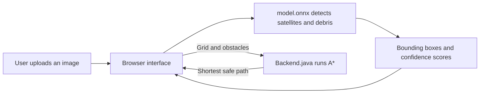

# OrbitGuard — Satellite and Space-Debris Detection

OrbitGuard is a five-file Java academic project that detects **satellites** and
**space debris** in uploaded images using a bundled YOLOv8 ONNX model. It also
demonstrates a Java A* planner for finding a route around confirmed obstacles.

> Educational prototype only. The output must not be used to command a
> spacecraft or make operational collision-avoidance decisions.

## Exactly five project files

| File | Purpose |
|---|---|
| `Backend.java` | Pure-JDK web server, health endpoint, model delivery, and A* planning |
| `Frontend.java` | Complete responsive HTML, CSS, and browser inference interface |
| `model.onnx` | Bundled 640 × 640 YOLOv8 satellite/debris detector |
| `README.md` | Setup, architecture, demonstration, references, and student details |
| `requirements.txt` | Documents the zero-Python-dependency runtime |

No Maven, Gradle, npm, React, or Python installation is required. Java source is
kept in two files; the browser code is embedded in `Frontend.java`.

## Application preview

The dashboard contains an image uploader, confidence control, annotated
detection canvas, result cards, model status, and an interactive A* planning
grid. A current screenshot is generated during verification rather than stored
as a sixth repository file.

```text
┌──────────────────────── OrbitGuard ────────────────────────┐
│  Satellite & debris intelligence             MODEL READY  │
├───────────────────────────┬────────────────────────────────┤
│ Upload image              │ Detection summary              │
│ Confidence threshold      │ Satellite / Debris / Confidence│
│ [ Run detection ]         │                                │
├───────────────────────────┴────────────────────────────────┤
│ Annotated image canvas                                      │
├────────────────────────────────────────────────────────────┤
│ Java A* collision-avoidance planning grid                  │
└────────────────────────────────────────────────────────────┘
```

## Technology stack

- **Java 21:** server, HTTP endpoints, validation, static delivery, and A*.
- **HTML/CSS/JavaScript:** embedded in one Java text block for the interface.
- **ONNX Runtime Web 1.30.0:** WebAssembly inference in the user's browser.
- **YOLOv8 ONNX:** two classes, `satellite` and `debris`.

The uploaded image stays inside the browser. The Java server sends the UI and
model, while inference is performed locally through WebAssembly.

## Architecture



The project has three main parts:

1. **Frontend:** `Frontend.java` contains the browser page. It accepts an image,
   prepares it at 640 × 640 pixels, and displays the final boxes and route.
2. **YOLO model:** `model.onnx` runs in the browser and returns the predicted
   class, confidence score, and location of each satellite or debris object.
3. **Java backend:** `Backend.java` serves the page and model. It also receives
   the grid, start, goal, and obstacles, then returns the shortest A* path.

The detection image stays in the browser. Only the planning-grid information is
sent to the Java backend.

## Start the complete program

### Prerequisites

1. JDK 21 or newer.
2. A modern browser with WebAssembly.
3. Internet access when the page first loads ONNX Runtime Web from jsDelivr.

Clone, compile, and run:

```powershell
git clone https://github.com/Shushant-Kharate/YoLo.git
cd YoLo
javac --add-modules jdk.httpserver Backend.java Frontend.java
java --add-modules jdk.httpserver Backend
```

Open **http://localhost:8000**. Stop the server with `Ctrl+C`.

`requirements.txt` contains no pip packages because Python is not used by the
running application. This optional command therefore installs nothing:

```powershell
python -m pip install -r requirements.txt
```

## How it works

1. The Java server binds to `127.0.0.1:8000`.
2. `Frontend.java` supplies the complete page at `/`.
3. The browser downloads `model.onnx` from the same local server.
4. An uploaded image is letterboxed to 640 × 640 and converted to an RGB tensor.
5. ONNX Runtime Web executes the YOLO model in the browser.
6. The interface parses the `[1, 6, 8400]` output, applies the confidence
   threshold and class-aware non-maximum suppression, then draws labelled boxes.
7. The planning grid sends start, goal, and obstacles to `/api/plan`.
8. Java A* minimizes `f(n) = g(n) + h(n)` with Manhattan distance for `h(n)`
   and returns the shortest reachable grid path.

## Knowledge representation, inference, and uncertainty

The knowledge-based portion represents each observation as a class
(`Satellite` or `Debris`), confidence value, and bounding box. The planning state
is a grid containing a start, goal, free cells, and blocked cells. Detection
inference transforms image evidence into object hypotheses. A* reasons over
confirmed obstacle cells and selects the lowest-cost route.

Uncertainty is handled through confidence scores. Predictions below the selected
threshold are rejected; overlapping boxes are reduced with non-maximum
suppression. Borderline predictions should be reviewed with additional sensor
evidence before being treated as hazards. A production system would also use
calibrated probabilities, multi-frame tracking, orbital data, and human approval.

## Sustainable solution and impact

- Local browser inference avoids uploading every image to a remote AI service.
- A compact reusable model and event-driven processing avoid continuous
  computation when no image is being analysed.
- Collision awareness can support longer spacecraft life and help prevent new
  debris, but this demonstrator does not predict real orbital conjunctions.
- Faster image triage may reduce operator workload and improve access to
  space-situational-awareness education.
- False positives may waste attention; false negatives may hide hazards.
  Responsible use requires validation, auditability, privacy, and human review.
- Computing consumes electricity and hardware becomes electronic waste.
  Efficient models, renewable power, repairable hardware, and selective
  retraining can reduce that footprint.

## SDG, PO, and PSO mapping

| Mapping | Contribution |
|---|---|
| SDG 9 — Industry, Innovation and Infrastructure | AI-supported space monitoring |
| SDG 12 — Responsible Consumption and Production | Satellite-life extension and prevention of additional orbital waste |
| SDG 13 — Climate Action | Protection of infrastructure used for Earth and climate observation |
| PO1 | Applies mathematics, computing, AI, and engineering fundamentals |
| PO2 | Analyses detection uncertainty and planning constraints |
| PO3 | Designs a usable Java AI prototype |
| PO4 | Supports experiments with thresholds, images, and obstacles |
| PO5 | Uses Java, ONNX, WebAssembly, YOLO, and browser tools |
| PO6/PO7 | Evaluates societal safety and environmental sustainability |
| PO8 | States ethical limits and preserves human oversight |
| PO10 | Communicates results through boxes, scores, and an interactive demo |
| PO12 | Demonstrates independent learning across AI, Java, and deployment |
| PSO1 | Applies programming and AI foundations to detection and planning |
| PSO2 | Builds an end-to-end intelligent application with modern tools |

Adjust PO/PSO numbering if the institution's official outcome wording differs.

## Sample output

```json
{
  "status": "ok",
  "runtime": "Java 21",
  "model": "model.onnx",
  "planning": "A*"
}
```

Example detection shown in the UI:

```text
Satellite  93.0%   box: x=112, y=76, width=148, height=201
Debris     88.4%   box: x=391, y=224, width=42, height=37
```

Values vary with the uploaded image and selected threshold.

## Demo walkthrough

1. Compile and start the Java application.
2. Open `http://localhost:8000` and wait for **Model ready**.
3. Upload a JPG or PNG space image.
4. Set the threshold and select **Run detection**.
5. Explain the class, score, bounding box, filtering, and NMS results.
6. Change the threshold to demonstrate uncertainty handling.
7. Click planning-grid cells to add or remove debris obstacles.
8. Select **Calculate route** and show the Java A* path changing.
9. Open `http://localhost:8000/api/health` to demonstrate the backend.
10. Explain the safety, societal, and environmental limitations.

## Model provenance

The included model is converted from
[`tanveeerr/space-debris-yolov8`](https://huggingface.co/tanveeerr/space-debris-yolov8).
Its model card describes a 640 × 640 YOLOv8 detector and reports precision
0.930, recall 0.926, mAP50 0.931, and mAP50–95 0.750. These are
author-reported figures, not independently reproduced by this project.

- Source `best.pt` SHA-256:
  `C1688F31B50CF881CCFE3FAC344AFF422601D5AF520BC4D286D95725487C4BB0`
- Included `model.onnx` SHA-256:
  `641A65C18A227C5C8A809EB3FD33F00617FCE10E61A4CE3CDB77796055B266D1`
- Export: Ultralytics 8.4.27, ONNX opset 17, fixed 640 × 640 input.

The source model card declares MIT. The converted ONNX metadata identifies the
Ultralytics export software and records AGPL-3.0; review both upstream terms
before redistribution or commercial use. ONNX Runtime is distributed under MIT.

## Reference paper

Md Younus Ahamed, Md Asif Bin Syed, Paroma Chatterjee, and Al Zadid Sultan Bin
Habib, “A Deep Learning Approach for Satellite and Debris Detection: YOLO in
Action,” *2023 26th International Conference on Computer and Information
Technology (ICCIT)*, 2023.
[DOI: 10.1109/ICCIT60459.2023.10441152](https://doi.org/10.1109/ICCIT60459.2023.10441152).

The paper motivates YOLO-based satellite/debris detection. The A* grid is an
educational extension; it is not orbital-path planning from the paper.

## Student details

| Field | Details |
|---|---|
| Student | Shushant Kharate |
| GitHub | [Shushant-Kharate](https://github.com/Shushant-Kharate) |
| Department | Information Technology |
| Institution | Fr. C. Rodrigues Institute of Technology, Vashi |
| Course | Artificial Intelligence |
| Roll number | Add before submission |
| Registration number | Add before submission |

## Troubleshooting

- **Port already used:** stop the process using port 8000, then restart.
- **Model does not become ready:** confirm `model.onnx` is beside the Java files,
  refresh, and check browser developer-console errors.
- **Runtime does not download:** allow network access to `cdn.jsdelivr.net`.
- **No detections:** use a relevant image and lower the confidence threshold.
- **`javac` is not recognized:** install JDK 21 and add its `bin` directory to
  `PATH`.
