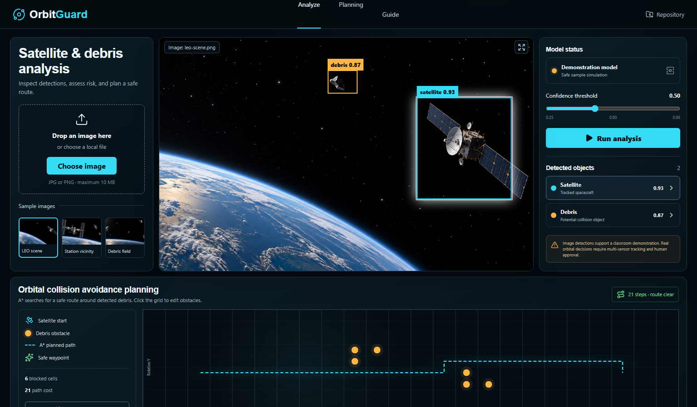

# OrbitGuard

OrbitGuard is an interactive university demonstration of a satellite and space-debris analysis workflow. It combines an image-analysis surface, confidence filtering, explainable demo detections, optional YOLO ONNX inference in Java, and a real A* path-planning visualizer.

> The bundled detections are a clearly labelled classroom simulation. Place an exported model at `models/best.onnx` to enable live inference through the Java backend. This project is not an operational spacecraft-control system.



## Bundled sample images

| LEO scene | Station vicinity | Debris field |
|---|---|---|
|  |  |  |

These generated images are included for demonstration and interface testing. They are not labelled scientific observations and should not be used to measure model accuracy.

## What the application demonstrates

- Select one of three bundled satellite/debris scenes or upload a JPG/PNG.
- Run an analysis and inspect classes, confidence values, and bounding boxes.
- Change the confidence threshold and see low-confidence detections disappear.
- Click a detection in the image or inspector to highlight the same object.
- Add or remove debris obstacles on the planning grid.
- Watch the A* algorithm recalculate the shortest collision-free route.
- Open the in-app **Guide** for a concise assessment demonstration sequence.

## Technology

- **Frontend:** React, Vite, CSS and Lucide icons
- **API:** Java 21 and Spring Boot
- **Optional live inference:** Microsoft ONNX Runtime for Java with `models/best.onnx`
- **Planning:** A* implemented in `src/lib/astar.js`
- **Python usage:** limited to the optional upstream YOLOv5 training/export commands

The application runtime does not require Python.

## Project structure

```text
YoLo/
├── backend-java/
│   ├── pom.xml
│   └── src/
│       ├── main/java/com/orbitguard/
│       │   ├── controller/    # REST endpoints
│       │   ├── model/         # API records
│       │   └── service/       # Demo and Java ONNX inference
│       └── test/              # Java tests
├── models/
│   └── README.md              # best.onnx and classes.txt instructions
├── public/
│   └── samples/               # Bundled demonstration images
├── src/
│   ├── components/            # React UI and planning components
│   ├── data/samples.js        # Sample metadata and UI detections
│   ├── lib/astar.js           # A* path-finding implementation
│   ├── App.jsx
│   └── styles.css
├── index.html
└── package.json
```

## Prerequisites

- [Node.js 20 or newer](https://nodejs.org/)
- Java Development Kit 21
- Apache Maven 3.9 or newer
- Git

Python is only needed if you want to train or export a YOLOv5 model yourself.

## Start the whole program

### 1. Clone the repository

```bash
git clone https://github.com/Shushant-Kharate/YoLo.git
cd YoLo
```

### 2. Verify Java and Maven

```bash
java -version
mvn -version
```

### 3. Install frontend dependencies

```bash
npm install
```

Maven downloads the Java dependencies automatically when the backend starts.

### 4. Start the frontend and Java API together

```bash
npm start
```

Open [http://localhost:5173](http://localhost:5173).

The Java API runs at [http://localhost:8000](http://localhost:8000). Check its status at [http://localhost:8000/api/health](http://localhost:8000/api/health).

## Quick demo without a trained model

The project works immediately after installation:

1. Run `npm start`.
2. Select **LEO scene**, **Station vicinity**, or **Debris field**.
3. Click **Run analysis**.
4. Move the confidence slider.
5. Select a bounding box or an object in the inspector.
6. Scroll to **Orbital collision avoidance planning**.
7. Click cells to add or remove debris and observe A* recalculate the route.

In this mode, the interface displays **Demonstration model**. The Java API returns clearly labelled sample detections. They are intentionally not presented as live predictions.

## Enable live YOLO inference in Java

1. Train or obtain a YOLOv5 model with the satellite/debris classes required by your dataset.
2. Export the trained weights to ONNX.
3. Copy the exported file to:

```text
models/best.onnx
```

4. Add one class name per line to:

```text
models/classes.txt
```

5. Restart `npm start`.
6. Upload a JPG or PNG and click **Run analysis**.

The model indicator changes to **Custom YOLO model**. Java performs image decoding, 640 × 640 preprocessing, ONNX Runtime inference, confidence filtering, non-maximum suppression, and JSON response generation.

### Important model note

The Java inference parser supports the common YOLOv5 ONNX output layouts `[1,N,classes+5]` and `[1,N,6]`. Generic COCO weights do not contain a dedicated space-debris class. Use a model trained on the required satellite/debris labels.

## Optional YOLOv5 training and ONNX export

The paper trained YOLOv5 for 20 epochs with a batch size of 16. The official YOLOv5 toolkit uses Python for training:

```bash
python train.py \
  --img 640 \
  --batch 16 \
  --epochs 20 \
  --data /path/to/data.yaml \
  --weights yolov5s.pt \
  --name spark_yolov5
```

Export the trained model:

```bash
python export.py \
  --weights runs/train/spark_yolov5/weights/best.pt \
  --include onnx \
  --img 640
```

Copy the resulting `best.onnx` to `models/best.onnx`. Python is not used after this export step.

## Run services separately

Frontend:

```bash
npm run dev
```

Java API:

```bash
mvn -f backend-java/pom.xml spring-boot:run
```

To use an API at another address, create a `.env` file before building the frontend:

```env
VITE_API_URL=http://localhost:8000
```

## Test and build

Run Java tests:

```bash
mvn -f backend-java/pom.xml test
```

Package the Java API:

```bash
mvn -f backend-java/pom.xml clean package
```

Build the frontend:

```bash
npm run build
```

The frontend is generated in `dist/`. The Java API JAR is generated under `backend-java/target/`.

## Demonstration script for LO 6.1 and LO 6.2

1. **Identify the input:** explain that the selected image represents optical surveillance data.
2. **Run analysis:** explain that YOLO predicts object class, confidence and bounding-box coordinates.
3. **Identify the tool:** show that Spring Boot exposes the API and Java ONNX Runtime performs optional model inference.
4. **Adjust uncertainty:** move the threshold and explain why lower-confidence objects need verification.
5. **Connect the modules:** state that detections become potential obstacles after orbital tracking confirms their positions.
6. **Demonstrate planning:** click the grid to add debris and show how A* searches for a new shortest safe route.
7. **State the limitation:** image detection alone cannot determine a safe orbital manoeuvre. Real deployment also requires multi-sensor tracking, orbital dynamics, validation and authorized human control.

## Troubleshooting

### `java` or `mvn` is not recognized

Install JDK 21 and Maven, set `JAVA_HOME`, and add both `JAVA_HOME/bin` and Maven's `bin` directory to your `PATH`. Restart the terminal and run:

```bash
java -version
mvn -version
```

### The interface stays in demonstration mode

- Confirm the model is named exactly `models/best.onnx`.
- Confirm `models/classes.txt` contains one class per line.
- Restart the Java API after copying the model.
- Open `http://localhost:8000/api/health` and verify that `mode` is `live`.

### Java ONNX inference fails

- Confirm the model is an exported YOLOv5 ONNX model.
- Confirm its input size is 640 × 640.
- Check the Java API terminal for the reported output-shape error.
- Remove or rename `best.onnx` to return to safe demonstration mode.

### The API is unavailable

The frontend falls back to bundled demonstration results. Check the terminal running Spring Boot, then open `http://localhost:8000/api/health`.

## Responsible-use statement

OrbitGuard is an educational prototype. Do not use its output for operational satellite manoeuvres. A real system must combine calibrated sensors, orbit determination, uncertainty modelling, conjunction assessment, human authorization and independent safety checks.
